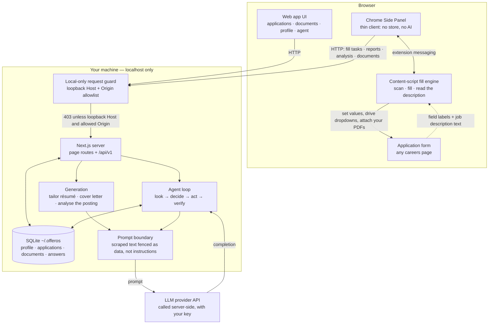

# OfferOS

[](https://github.com/averatec0773/offeros/actions/workflows/ci.yml)
[](LICENSE)


Local-first, open-source **AI job-application agent**.

Most AI job tools stop being intelligent the moment you hit Apply. OfferOS is
built around an agent whose work _starts_ there: it knows where every
application stands, reads the per-field record of every form fill, and answers
_"which of these are stuck, and why?"_ with the evidence attached.

Everything runs on your machine. `apps/web` (Next.js) owns your data in a local
SQLite file and makes every AI call with your own key; `apps/extension` (a
Chrome Side Panel) is the agent's execution arm on real application forms.
**Submitting is yours** — OfferOS stops at the submit button and waits.

---

## The idea in one minute

1. **Build a profile once.** Upload a résumé and it populates education,
   experience, skills, saved answers and EEO presets.
2. **Add jobs by pasting a link.** On a readable job board OfferOS pulls the
   title, company and description itself, and checks what the form will ask.
3. **Apply.** The panel fills what it can from your profile, hands the rest to
   the agent, and shows every field's status as it lands. You review the page
   and press submit yourself.
4. **Ask afterwards.** _"Which of these are stuck?"_ _"What did it put in the
   relocation field?"_ _"Which questions do I keep being asked and have never
   answered?"_

That last one is the point. **The more you apply, the less there is to do** —
every question a form asks is remembered, so the ones you have never answered
become a short list you can clear once and never see again.

---

## The agent

Talk to it on `/agent`, or from inside a single application. It works in a loop
of small verified steps — **look first**, then answer — and shows the steps that
produced each answer rather than hiding them.

It can also **do** things: save an answer, update an application, tailor a
résumé, revise a cover letter. Four rules keep that honest:

| Rule                                        | What it means                                                                                                                                 |
| ------------------------------------------- | --------------------------------------------------------------------------------------------------------------------------------------------- |
| **Looking is free, doing is rationed**      | Six steps per turn, at most **two changes**.                                                                                                  |
| **Every write verifies itself**             | It re-reads what it wrote, and the check lands in the same trace you see in chat.                                                             |
| **Gates live in the tools, not the prompt** | Marking an application submitted refuses unless _you_ said you submitted it — no phrasing, and no text scraped from a page, can talk past it. |
| **It cannot omit what it did**              | When a turn runs out of budget, the harness — not the model — puts the writes it completed into the final answer.                             |

**Handing the hard fields to it.** When the deterministic engine runs out of
fields it recognises, one click sends the remaining questions to the agent with
your profile, your résumé, the job description and your saved answers. What
comes back is a **suggestion with its evidence**, and you decide. It never
writes into the form on its own.

---

## Where it refuses to guess

This is the part worth reading if you build agents for a living.

**Evidence is checked, not requested.** The model must quote the source text
behind every value it proposes. The server then looks for that quote _in the
source it named_ — profile, résumé, job description, saved answers — and throws
away anything it cannot find, handing the field back to you instead. "Do not
make things up" is a hope; this is arithmetic.
→ `apps/web/src/server/services/field-analysis-service.ts`

**Three kinds of question are never answered for you.** Voluntary
self-identification, facts only you can state (work authorisation, sponsorship,
salary), and policy acknowledgments. The refusal is decided from the field's own
text _before_ the model runs, so no model output can unlock it.
→ `packages/autofill/src/guards.ts`

**A default is not an answer.** A dropdown showing `-None-` has not been
answered; a dropdown resting on a real option has been, even when that option
reads "Unknown". The scan answers three ways — yes, no, or _cannot tell_ — and
only the last consults the wording.

**A field never disappears.** Anything OfferOS tried to fill ends as one of
three things: filled, explicitly failed, or explicitly yours. Silence is not an
outcome.

**"I could not tell" is a real answer.** Checking whether a posting is still
open returns _open_, _closed_, or _could not tell_ — never a guess. Résumé
checks that cannot run on a given document say nothing rather than reporting a
pass.

**Nothing scraped is ever an instruction.** Page text and uploaded documents are
fenced as data before they reach a model.

---

## What's inside

- **Applications** — everything you are tracking, its state, and a fit badge.
- **Application record** — one page per job: the description with your matching
  skills highlighted, what the form asks and what you can already answer, the
  fill report field by field, and the documents to send.
- **Documents** — every generated résumé and cover letter in one place, named,
  renameable, with a workbench per document: revise in plain language, read the
  diff, keep the version history, export a PDF.
- **Answer gaps** — the questions your applications keep asking that you have
  never answered, ordered by how often they come up. Zero AI: it is a count.
- **Résumé checkup** — nine deterministic rules (length, missing sections,
  bullet shape, tense and punctuation consistency, dates, contact details). No
  model, no API credit, and a rule that cannot run stays quiet.
- **Job reconnaissance** — is this posting still up, and what will its form ask?
  Status codes and the platform's own API, not a model.
- **Fill engine** — a DOM-free classification library the extension executes.
  Every filled value carries the reason it was chosen.
- **Form memory** — each question is remembered by its content, so the same
  question on two postings is recognised as one question.
- **Bring your own model** — Anthropic or OpenAI, your key, stored locally and
  never sent to the browser. Per-task prompt and model overrides.
- **Style memory** — a revision you accept teaches a note about your tone. Tone
  only, never facts.

---

## Quickstart

```bash
npm install
npm run dev:web     # http://localhost:3000
```

Open **Settings → AI**, pick a provider, paste your API key. No restart, no
dotfiles. Your data lives in SQLite at `~/.offeros/offeros.db` — no account, no
cloud — and your key only ever travels to the provider you chose.

**The extension** works on any careers page.

```bash
npm run build -w @offeros/extension   # → apps/extension/.output/chrome-mv3/
```

1. `chrome://extensions` → Developer mode → **Load unpacked** → pick
   `apps/extension/.output/chrome-mv3/`.
2. Keep the web app running, or run `npm run host:install` once and let the
   panel start it for you.
3. Open an application form, click the OfferOS icon, and fill.

Chrome will tell you at install that the extension can read and change data on
all sites. It can — a job posting can live on any domain. What it actually does
with that is in [SECURITY.md](.github/SECURITY.md).

---

## Architecture



The guard runs in Next middleware, so it covers page routes as well as the API —
the extension is just another local client of the same surface.

---

## How it is built

**Seams, not layers of glue.** Adding a job platform is one adapter file and one
line in a registry. Adding a source of "what forms ask me" is the same, and a
contract test registers a source that exists only inside the test to prove the
layers above it need no change. Adding a résumé rule is one entry in an array.
→ `packages/core/src/question-coverage.ts`, `apps/web/src/server/extract/vendors/`

**Ask the page, don't guess.** Most autofill infers a field's meaning from its
visible label, and that inference is where fills die. Major platforms already
carry a machine-readable description of each field; reading it turns
classification into a lookup. Measured across six live forms, question text went
from **37.5% correct to 100%**, and 157 raw controls collapsed into 81 real
questions. It is a safety property too: the guards that refuse work-authorisation
questions match on question text, and a blank label matches nothing.
→ `packages/autofill/src/field-meta.ts`

**Failures are grouped in code, not by a model.** Which fields failed for the
same reason has an exact answer, so a function computes it — and the chat and
the developer-facing ledger read the same events.
→ `packages/autofill/src/diagnose.ts`

**Roughly 2,500 tests**, and seven gates (lint, formatting, types, both test
suites, both builds) run locally before anything can be pushed. The agent also
has a fixture-based evaluation suite for the behaviours that regressed once —
it needs a provider key, so it is opt-in rather than part of CI.

---

## Privacy & safety

- **Submitting is yours.** The submit click happens on the page, by you.
  (Settings → AI & Agent carries an auto-submit preference that is **not wired
  to anything**; both it and this line say so until that changes.)
- **Only your own files are attached.** OfferOS never reads a file from the page.
- **Your key stays server-side.** The extension never sees it.
- **Local-first.** Everything is on your machine, in one SQLite file you can
  copy, back up, or delete.

These describe the current implementation and are pinned by tests. The full
security model, and how to report an issue privately:
[SECURITY.md](.github/SECURITY.md).

---

## Development

```bash
npm run dev:web     # web app dev server → http://localhost:3000
npm run dev         # extension dev build with HMR (separate browser)
npm run typecheck   # web + packages + extension
npm test            # root Vitest (packages + apps/web) + extension Vitest
npm run e2e -w @offeros/extension   # headed E2E: real Chromium, built extension
npm run e2e:vertical -w @offeros/extension # headed web → extension → ATS E2E
```

Node 24+. An npm-workspaces monorepo: `apps/web` (the product), `apps/extension`
(the fill arm), and `packages/*` — `core` (domain schemas, IO-free), `llm` (the
provider layer), `autofill` (the DOM-free fill engine both apps share), `pdf`
(text extraction). Rebuilding the extension auto-reloads a loaded unpacked copy
within about two seconds. Contributions:
[CONTRIBUTING.md](.github/CONTRIBUTING.md).

## License

Apache-2.0.
